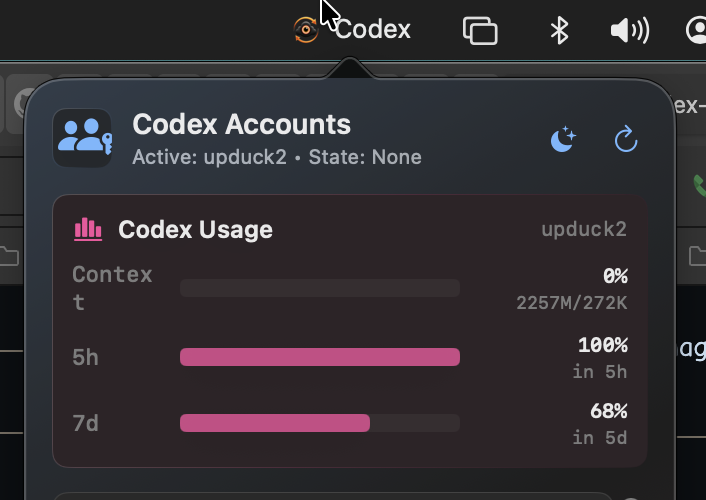

# Codex Account Manager: Clanked Edition

Codex Account Manager: Clanked Edition is a local-first macOS app for managing multiple Codex Desktop accounts on the same Mac. It lets you save each signed-in Codex session as a local profile, switch between profiles quickly, inspect auth metadata, and recover from revoked refresh tokens without manually copying `auth.json`.

The project is designed for people who regularly move between personal, work, team, or client Codex accounts and want a safer workflow than hand-editing local auth files.

## Highlights

- Manage multiple Codex Desktop profiles on macOS.
- Change the active profile and Codex Desktop state independently.
- Save and restore `~/.codex/auth.json`.
- Save and restore Codex Desktop state from `~/Library/Application Support/Codex`.
- Inspect profile metadata such as auth mode, email/account id, plan, workspace, seat type, and refresh time.
- See profile health at a glance, including missing auth, invalid auth, expired access tokens, and auth-only profiles.
- Add local nicknames to profiles so accounts with similar emails are easier to distinguish.
- Rename saved profile IDs from the app.
- Import an existing `auth.json` as an auth-only profile.
- Export a selected profile as a local zip backup.
- Hide sensitive account details while screen sharing.
- Use Token Vault to reveal or copy tokens only when you explicitly choose to.
- Review token status for access, refresh, and ID tokens without revealing token values.
- Update a saved profile's token explicitly after re-authentication, with account-identity checks.
- Bind each profile and nickname to the original signed-in user so shared Team account IDs cannot mix labels or tokens.
- Shade inactive menu-bar profiles from neutral grey to red using their highest observed context, 5-hour, or 7-day usage.
- Run fully locally. No token or profile data is uploaded anywhere.

## What Is New

The latest UI refresh adds a clearer account-management view inspired by operational dashboards while staying native to macOS:

- Profile cards now show health badges and account context, such as plan and workspace.
- The detail view includes editable account nicknames, profile rename controls, privacy controls, token health, and richer auth metadata.
- The account workflow now includes auth import, local profile backup export, and faster menu bar actions inspired by tray-first account switchers.
- Token parsing is more tolerant of Codex auth format changes, including both snake_case and camelCase token keys.
- Saved nicknames are preserved when an existing profile is captured again.

## Clanked Edition Changes From the Original

This fork builds on the [original Codex Account Manager](https://github.com/ngnthanhdev/codex-account-manager) with a few opinionated account-switching improvements:

- **Safer profile identity:** profiles retain the original signed-in user identity, preventing shared Team account IDs from making labels or tokens bleed between accounts.
- **Explicit active-profile switching:** **Make Active Profile** updates the live auth file and restarts Codex so the selected account is actually live.
- **Separate desktop state:** the current Codex Desktop state can be changed independently from the active auth profile.
- **Recovery controls:** a profile can be re-authenticated and its saved auth token updated after a login flow.
- **Nicknames and compact UI:** profiles support friendly labels, and the menu-bar account picker keeps the most useful controls in a compact layout.
- **Usage heat shading:** inactive profiles are refreshed from their saved quota data and shaded from grey through red by 5-hour exhaustion. A fully exhausted 7-day limit also forces the row fully red; other weekly usage does not affect the tint. The separate context-window meter does not affect this tint. Grey means 0% consumed/100% remaining; red means 100% consumed/0% remaining. Missing quota data stays neutral grey.
- **Consistent usage refresh:** opening or refreshing the menu-bar picker refreshes the same per-profile quota snapshots used by the main manager.
- **One usage source:** the taskbar shows the same consumed-percent 5-hour and 7-day quota windows as the main profile cards; its separate context-window meter has been removed.
- **Clanked branding:** the app is branded **Codex Account Manager: Clanked Edition** and uses a transparent eye-cloud icon with refresh arrows.

## Screenshots

The compact menu-bar picker surfaces current usage and account switching without requiring the full manager window:



The app icon combines the Codex cloud, the supplied eye artwork, and the refresh arrows:


## Requirements

- macOS.
- OpenAI Codex Desktop App.
- Swift compiler, usually installed with Xcode Command Line Tools.
- `jq` for shell-side account identity checks (`brew install jq` if it is not already installed).

Check Swift:

```bash
swift --version
```

Install Xcode Command Line Tools if needed:

```bash
xcode-select --install
```

## Installation

Clone the repository:

```bash
git clone https://github.com/ngnthanhdev/codex-account-manager.git
cd codex-account-manager
```

Build the app:

```bash
chmod +x build-app.sh codex-account-switcher.sh
./build-app.sh
```

Open the app:

```bash
open "build/Codex Account Manager Clanked Edition.app"
```

After launch, the **Codex Account Manager: Clanked Edition** window should appear. If it does not, click the app in the Dock or choose **Window > Show Manager** from the macOS menu bar.

## Usage

### 1. Save Your First Account

1. Open Codex Desktop.
2. Sign in with your first account.
3. Open Codex Account Manager.
4. Enter a profile name, for example:

```text
personal
```

5. Click **Capture**.

The current Codex login state is now saved as the `personal` profile.

### 2. Give an Account a Nickname

Saved profile IDs are used for switching and storage, while nicknames are the friendly labels shown throughout the app and menu bar.

1. Find a saved profile card.
2. Click the pencil next to its name.
3. Enter a nickname such as `Personal`, `Work`, or `Client - Acme`.
4. Click the checkmark or press Return to save it.

Nicknames are stored locally in the profile's `profile.env`. The manager also records the profile's original user identity in `identity.json`; if a different user's auth is ever copied into that profile, the nickname is hidden and switching is blocked instead of displaying a misleading account/label pair.

### 3. Add Another Account

1. Click **Add Account** in the manager.
2. Complete the Codex login for the new account in the browser or terminal prompt.
3. The manager imports the new login as a separate auth-only profile. Give it a nickname if you want a friendlier label.

You can still log in manually in Codex Desktop and use **Capture** with a new profile name, but the Add Account flow keeps the temporary login home isolated and removes it after import.

### 4. Make a Profile Active

1. Find the saved profile card for the account you want.
2. Click **Make Active Profile** on that card.

The selected profile becomes the account Codex uses on this Mac. The manager first saves the refreshed live auth for the outgoing profile, then installs the selected auth file and reopens Codex. This changes the account only; it does not change the separate Desktop state selection.

If the live auth cannot be matched to exactly one saved profile, the switch is refused so no account token is discarded.

### 5. Change the Current Machine State

1. Find the saved profile card for the Codex Desktop state you want.
2. Click **Use This State** on that card.

This changes only the saved Codex Desktop state in `~/Library/Application Support/Codex`. Your active profile stays unchanged.

Changing either selection will:

- Quit Codex Desktop.
- Restore the selected account or Desktop state.
- Open Codex Desktop again.

### 6. Update an Auth Token After Re-Login

1. Click **Re-authenticate** on the profile whose token needs to be refreshed.
2. Complete the isolated Codex login for that account.

The manager then replaces that profile's saved auth. If the profile is active, it also replaces the live auth while Codex is stopped and opens Codex again.

For a login you completed manually in the live Codex session, log out and sign back in to the same account, then click **Update Auth Token** on the matching profile card. The manager verifies the JWT user subject (or email fallback) before replacing the saved token. A shared Team `account_id` alone is never treated as proof that two logins are the same user.

If a profile shows **Identity Mismatch**, click **Re-authenticate** and sign in as the account originally anchored to that profile. The new login is checked against the stored identity before it replaces anything; the prior saved auth is retained under that profile's `auth/recovery` folder for diagnosis.

## Token Vault

Token Vault reads tokens from the selected profile's `auth.json`.

- Tokens are hidden by default.
- Enable **Reveal** to view the selected token inside the app.
- Click **Copy** to copy the selected token to the macOS clipboard.
- Tokens are not printed to terminal, written to logs, or sent over the network.

Common token fields:

- `access_token`
- `refresh_token`
- `id_token`

## Revoked Refresh Tokens

If Codex shows this error:

```text
Your access token could not be refreshed because your refresh token was revoked.
Please log out and sign in again.
```

the saved profile contains a refresh token that OpenAI has revoked. Codex Account Manager cannot refresh a revoked token. You need to sign in again so Codex can create a fresh token.

Recovery flow:

1. Click **Re-authenticate** on the broken profile.
2. Sign in again with the same account.

The manager cannot refresh a revoked token itself; Codex must create the replacement during login.

## CLI

The app uses the local `codex-account-switcher.sh` script under the hood. You can also run it directly:

```bash
./codex-account-switcher.sh capture personal
./codex-account-switcher.sh make-active work
./codex-account-switcher.sh make-state client
./codex-account-switcher.sh switch work
./codex-account-switcher.sh rename personal personal-main
./codex-account-switcher.sh import-auth client ~/Downloads/auth.json
./codex-account-switcher.sh export-profile work ~/Desktop/work.codex-profile.zip
./codex-account-switcher.sh list
./codex-account-switcher.sh active
```

## Contributing

Bug fixes and improvements are welcome through pull requests.

- Report bugs with GitHub Issues.
- Send fixes through Pull Requests into `main`.
- Never include tokens, `auth.json`, cookies, profile folders, or real login data.
- See [CONTRIBUTING.md](CONTRIBUTING.md) for the full contribution guide.

To require owner review before changes are merged, enable branch protection for `main` on GitHub:

1. Go to **Settings > Branches**.
2. Add a rule for `main`.
3. Enable **Require a pull request before merging**.
4. Enable **Require approvals**.
5. Enable **Require review from Code Owners**.

## Local Data

Profiles are stored at:

```text
~/Library/Application Support/CodexAccountSwitcher
```

Each profile uses this structure:

```text
profiles/<name>/auth/auth.json
profiles/<name>/app-support/Codex
profiles/<name>/profile.env
profiles/<name>/identity.json
```

Do not commit or share this profile folder. It contains tokens, cookies, and Codex Desktop login state.

Profile backup zip files exported by the app contain the same sensitive data. Store them privately and delete old backups when you no longer need them.

## Security

Codex Account Manager is local-first:

- It does not upload tokens.
- It does not send profile data to a custom server.
- It does not store tokens in Git.
- It does not log token values to files or terminal output.

Treat the profile folder as sensitive data, just like a password manager export or a browser session.

## Build Output

After a successful build:

```text
build/Codex Account Manager Clanked Edition.app
```

The `build/` directory is ignored by Git.

## Release Pipeline

GitHub Actions builds the macOS app on every push or pull request to `main`.

To publish a release, push a version tag:

```bash
git tag v1.0.0
git push origin v1.0.0
```

The release workflow will:

- Validate `codex-account-switcher.sh`.
- Build `build/Codex Account Manager Clanked Edition.app`.
- Package the app as a zip file.
- Create a GitHub Release for tags that start with `v`.
- Upload the zip as a release asset.

The release asset is currently unsigned and not notarized. macOS may show a Gatekeeper warning until code signing and notarization are added.

## License

MIT License. See [LICENSE](LICENSE).
